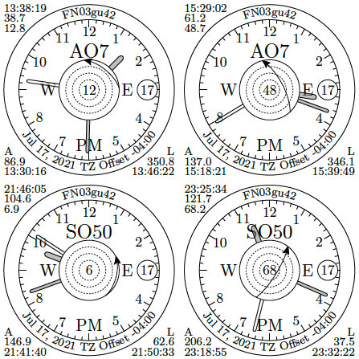

# Calculating satellite passes - SatPass
### What is it for?
Calculate parameters of the coming satellite passes: 

- the exact time and azimuth of a satellite rising above the horizon (AOS)
- the time, azimuth and elevation of the satellite pass at the moment when it reaches its highest point
- the time and azimuth of the satellite when it goes below the horizon (LOS)

These parameters can be represented in a visual form and a series of these visual representations for a number of coming satellite passes can be saved as a pdf file. Here is an example:



### What it consists of?
There are 3 utilities written in Python:

**gettle.py** is used to download satellite TLE files. You have to keep your locally saved TLE files up-to-date to produce reliable satellite pass information.

**satpass.py** performs calculations for one or more satellites that are going to be observed from a single location. 

**passpdf.py** creates a pdf file with visual representations of the passes based on the data calculated by satpass.py.

In addition to Python 3 and a number of Python modules the **satpass.py** utility requires a shared library to be installed: [General Astrodynamics Library - libgal](http://www.amsat-bda.org/GAL_Home.html). A copy of the distribution of the library version 0.6.0 is included in directory LibGAL.

### Where can it run?
Since the required library is written in C++ and the utilities are written in Python 3 (well, there is also a Cython component), in theory, it can run anywhere. However, it was tested under linux on some Raspberry Pi models (including Pi Zero) and under Mac OS with Python, Cython and various Python packages installed using macports. 

### How to install?
There are 3 major steps:

1. LibGAL

  It is recommended that you start with installing LibGAL first. Installation instructions are included within its distribution package. The link mentioned above contains some documentation on the library.

2. Module psgp4gm

  After you generate the **libgal** library, go to the **psgp4gm** folder and update the **build.sh** script so that the variables point to the correct locations in your environment. There is no script for Windows (sorry), but, perhaps, a similar install could be done under Cygwin. You will need Cython to compile the **psgp4gm** package. After successful run of the build you should have the **psgp4gm.so** library that will be recognized by Python as a an external module. It serves as a wrapper around **libgal**, so that the Python code can make use of this library.

3. Python Code

  Since the utilities are written in Python 3, they can simply be copied to a directory of your choice and run from there.

### How to configure?
There is a configuration file that is used to keep a list of satellites, an optional list of geographic locations and some other running options. The file is in the **yaml** format and can be created and/or edited by any text editor. A sample configuration file is provided: **satellites.conf** in the **data** sub-directory. When TLE data is downloaded from the internet, a small file containing TLE information is created for each satellite. These files will be created on the first successful run of the **gettle.py** utility. The location of the files is specified in the configuration. With provided configuration file this location is the same **data** sub-directory where the configuration file is located.

### How to use?

Start with refreshing (or populating, if this is your first time) the TLE data. To do it simply run the command:

```
python gettle.py
```
When it gets its job done successfully, run the following command to create a pdf file with satellite passes:

```
python satpass.py -g FN03gu -a 270m -z -0400 so50 | python passpdf.py
``` 
The pass information will be calculated for satellite SO-50 observed from geographic location in the centre of the FN03gu grid square at the hight of 270m (you can also specify 886ft). All dates and times will be local for the timezone with the offset -4 hours. The name of the pdf file will be chosen automatically and will include the date and time of the beginning of first pass and the location name (grid square in this case). 

There are additional options for all utilities, use **--help** to display them (for example, **python gettle.py --help**).

Please, keep in mind that generating **pdf** files may take some time depending on how modern your computer is. 

### What is the License?
The Python code is distributed under the "MIT" (some also call it "Expat") license. However, because of the fact that the **libgal** library is distributed under GNU GPL 2, the entire package is governed by the **GNU GPL 2** license.
